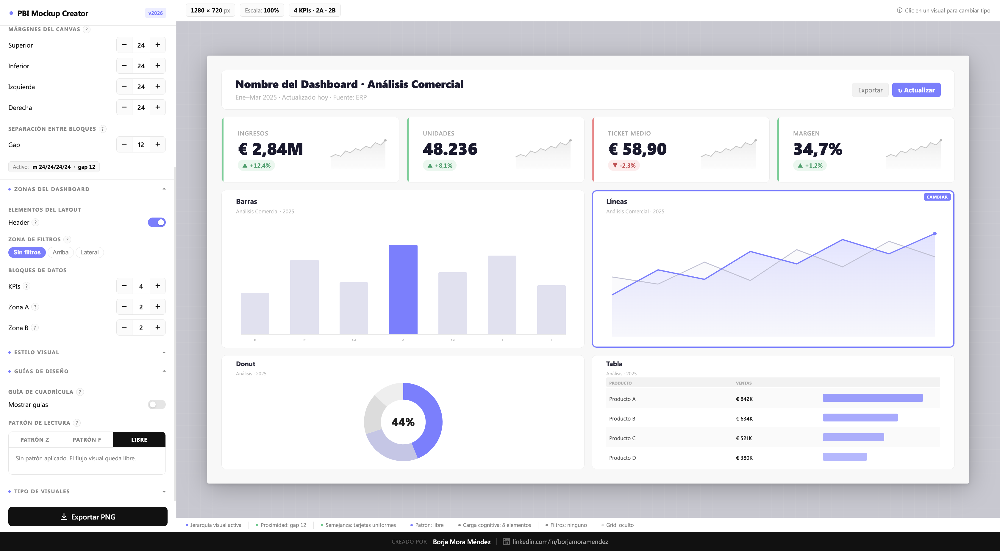

# PBI Mockup Creator

> **Herramienta avanzada de wireframing para dashboards de Power BI — en el navegador, sin instalación, sin dependencias.**

Diseña, itera y valida la estructura visual de tus informes antes de construirlos en Power BI. Control total sobre layout, jerarquía, zonas, patrones de lectura y tipos de visuales — con exportación lista para compartir.

Para visualizarlo: https://borjamoramendez.github.io/pbi-mockup-creator/

## Demo

## ¿Por qué existe esta herramienta?

En proyectos de Business Intelligence, el mayor coste no está en los datos, sino en la iteración visual.

Construir dashboards directamente en Power BI para luego rehacerlos implica:
- Tiempo perdido  
- Fricción con stakeholders  
- Decisiones de diseño tardías  

**PBI Mockup Creator** mueve esa iteración a una fase previa, rápida y sin fricción.

💡 Diseñas primero → validas → luego construyes.

## Características

### 🧱 Canvas & Layout
- Presets de tamaño:
  - **16:9 (1280×720)**
  - **4:3 (1024×768)**
  - **Carta**
  - **Tooltip**
  - **Móvil**
  - **Custom**
- Márgenes configurables por lado (precisión de 1 px)
- Gap entre bloques configurable
- Control de:
  - Radio del canvas
  - Radio de tarjetas

### 🧩 Zonas del dashboard
- **Header configurable**
  - Título y subtítulo editables
  - Tamaño de fuente configurable
  - CTA / botón de acción

- **Zona de filtros**
  - Sin filtros
  - Arriba
  - Lateral

- **Bloques de datos dinámicos**
  - KPIs: 0–6
  - Zona A (principal): 1–4 visuales
  - Zona B (secundaria): 1–4 visuales

### 📊 Tarjetas KPI
- Valor principal configurable (10–48 px)
- Indicadores de tendencia (positivo / negativo)
- Mini gráfico integrado:
  - **Sparkline**
  - **Columnas**
  - O sin gráfico
- Diseño optimizado para lectura rápida (no compite con el dato)

### 📈 Tipos de visuales (15+)
Intercambiables con un clic:

- Barras  
- Líneas  
- Tabla  
- Cascada  
- Funnel  
- Área  
- Matriz  
- Columnas  
- Lollipop  
- Dumbbell  
- Slope  
- Drill-through  
- Tooltip  

✔️ Pensados para cubrir el 95% de casos reales en Power BI

### 🎨 Estilo visual
- Fondo de canvas configurable  
- Fondo de tarjetas configurable  
- Bordes personalizables  
- Sistema visual coherente  

### 📐 Guías de diseño
- **Cuadrícula (grid system)**
  - Activable/desactivable
  - Alineación precisa

- **Patrones de lectura**
  - **Patrón Z**
    - Flujo natural: izquierda → derecha → diagonal → CTA
    - KPIs arriba, acción abajo derecha

  - **Patrón F**
    - Escaneo digital típico
    - Refuerzo en primera fila

  - **Modo libre**

✔️ Visualización del flujo directamente en el canvas

### 🧠 Plantillas inteligentes
Arranque rápido con presets:

- **C-Suite** → KPIs + tendencia + tabla pro  
- **Comercial** → Seguimiento de ventas  
- **Analítico** → Deep dive de datos  
- **Storytelling** → Narrativa visual  
- **Operacional** → Monitorización diaria  

### 💾 Guardar & Cargar (JSON)
- Guarda toda la configuración como `.json`
- Permite:
  - Reutilizar layouts
  - Versionar diseños
  - Compartir con equipo

### 📤 Exportación
- Exportación a:
  - **PNG**
  - **PDF**
- Resolución optimizada (2×)
- Listo para:
  - Presentaciones
  - Documentación
  - Validación con clientes

## 🧠 Principios de diseño aplicados

- Proximidad (Gestalt) → agrupación mediante spacing  
- Semejanza → coherencia entre tarjetas  
- Jerarquía visual → Zona A vs Zona B  
- Carga cognitiva → control de elementos visibles  
- Patrones Z & F → navegación natural del usuario  
- Consistencia → sistema visual uniforme  

## 🎯 Casos de uso

- Diseño previo de dashboards Power BI  
- Validación con clientes antes de desarrollo  
- Documentación de layout  
- Formación en diseño de dashboards  
- Prototipado rápido en consultoría BI  

## Autor

**Borja Mora Méndez**  
Especialista en Business Intelligence y visualización de datos  

[LinkedIn](https://www.linkedin.com/in/borjamoramendez/)

