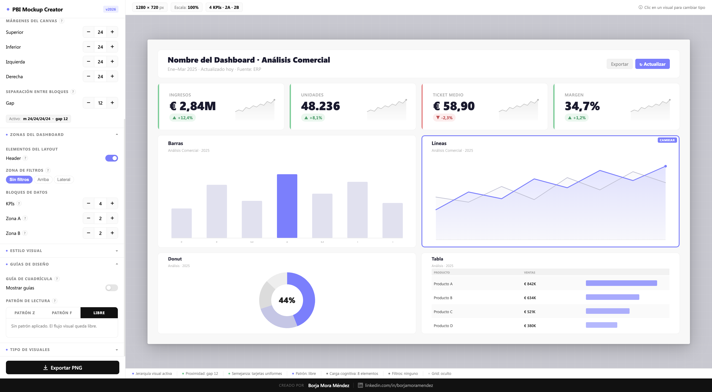

# PBI Mockup Creator

> Diseña el layout de un dashboard de Power BI antes de construirlo. En el navegador, sin instalación y sin cuenta.

**Abrir la herramienta:** https://borjamome.github.io/powerbi-mockup/



## Por qué existe

En un proyecto de BI, lo caro no suele ser el modelo de datos, sino rehacer páginas. Si el layout se decide dentro de Power BI, cada cambio de opinión del cliente obliga a mover visuales, recalcular tamaños y volver a validar.

Esta herramienta adelanta esa conversación: defines quién mira el dashboard y qué decide con él, montas la estructura en unos minutos, la revisas con criterios de percepción visual y llegas a Power BI con el plano ya aprobado.

## Qué puedes hacer

**Empezar rápido**
- 7 plantillas por área: Comercial, Financiero, RRHH, Marketing, Retail, C-Suite y E-commerce. Cada una trae layout, KPIs y títulos propios.
- «Historia del dashboard»: eliges audiencia (C-Suite, Comercial, Analistas o Cliente), escribes la decisión y el dato clave, y la herramienta propone plantilla y patrón de lectura.

**Montar el layout**
- Formatos de página: 16:9, 4:3, Carta, Tooltip, Móvil y tamaño personalizado.
- Márgenes por lado, separación entre bloques, header, filtros (barra superior o lateral), de 0 a 6 KPIs y dos zonas de visuales (A principal, B secundaria).
- Proporciones de altura por zona con deslizadores.
- Diseño libre: arrastra, redimensiona con guías de ajuste, mueve con las flechas y alinea con el visual vecino.

**Elegir visuales**
- 25 tipos agrupados como en el panel de Power BI: barras y columnas (apiladas, agrupadas, 100 %), líneas, áreas, combinados, cintas, cascada, embudo, dispersión, anillos, mapa de árbol, tabla, matriz, lollipop, dumbbell y slope.
- Clic en un visual del lienzo para abrir su selector; Mayús + clic para rotar el tipo.
- Doble clic en cualquier título, subtítulo o valor KPI para editarlo en el propio lienzo.

**Revisarlo con criterio**
- Diagnóstico con cinco principios de la Gestalt (proximidad, jerarquía visual, semejanza, cierre y figura-fondo). Cada uno explica qué mide, enseña un ejemplo bien y mal aplicado, evalúa tu diseño y propone arreglos de un clic. La barra superior muestra cuántos principios están correctos.
- Patrones de lectura Z, F y por capas superpuestos sobre el lienzo.
- Cuadrícula de guía configurable y aviso de contraste entre fondo y tarjetas.

**Guardar y compartir**
- El diseño se guarda solo en el navegador y se recupera al volver.
- Deshacer y rehacer (Ctrl+Z / Ctrl+Y).
- Exportación a PNG (2×) y a PDF de una página con el tamaño del canvas, sin guías ni marcas de edición.
- Proyecto en `.json` para retomarlo en otro equipo o pasárselo a alguien.
- Tres temas de interfaz (claro, oscuro y cálido) y modo presentación.

## Atajos de teclado

| Acción | Atajo |
|---|---|
| Deshacer / rehacer | Ctrl+Z / Ctrl+Y |
| Exportar PNG / PDF | Ctrl+E / Ctrl+P |
| Guardar / abrir proyecto | Ctrl+S / Ctrl+O |
| Zoom / ajustar | Ctrl + / Ctrl − / Ctrl 0 |
| Diseño libre · presentación · diagnóstico | E · P · G |
| Ver todos los atajos | ? |

En Mac, Ctrl es ⌘.

## Principios en los que se apoya

Proximidad para agrupar, semejanza entre tarjetas, jerarquía entre la zona A y la B, carga cognitiva (cuántos elementos compiten por la atención) y patrones de lectura para colocar arriba a la izquierda lo que más importa. Son los mismos criterios que aplico en mis proyectos de Power BI.

## Cómo está hecha

Un único `index.html` con HTML, CSS y JavaScript sin framework ni paso de compilación. Los gráficos del lienzo son SVG generados en el momento; la exportación usa [html2canvas](https://html2canvas.hertzen.com/) y [jsPDF](https://github.com/parallax/jsPDF). Funciona con teclado, respeta la preferencia de movimiento reducido y en móvil avisa de que está pensada para pantalla grande.

Para usarla en local basta con abrir `index.html` o servir la carpeta:

```bash
python -m http.server 8000
```

---

Hecha por [Borja Mora Méndez](https://borjamora.es/), Data Analyst Junior · [LinkedIn](https://www.linkedin.com/in/borjamoramendez/)
